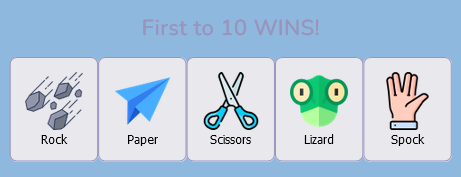
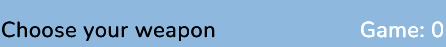
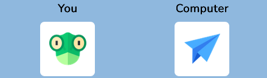
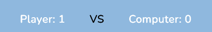
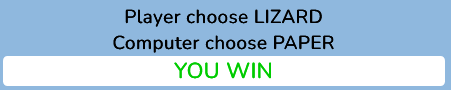

Rock, paper, scissor, lizard and spoke Game
 
 responsive design

 * [View live website here](https://jadey1223.github.io/-Rock-Paper-Scissors-Lizard-Spock-Game/)

  # features

  ### Reset Button

- This button resets all counting points for the computer score and user score. This also resets the game counter.

### Rules Button

- This button is modal, when click it pops up with the rules of the game on how each hand wins against another hand. This helps the user to under the logistics of the game.

### Players hand selection

 - The user has a choice of 5 different weapons. Rock, Paper, Sissors, Lizard, Spock. Theses choices are represented as clickable buttons.

 

### Game Counter *

- This game counter gives the player more information regarding on how many hands they have played.

### Display image Choice  (user-choice) / (computer-choice)

- In the empty square it will display five of the options given. One of theses options will be displayed once clicked. This also shows the user what option it has choicen*. The right-hand side of the selected user-choice will be the computer-choice. This will help the user identify what it will be up against.

### Player score and Computer Score

- This will display a count for each time the player or computer score wins.

### display text Choice  (user-choice) / (computer-choice)

- In this field it will display text of the selected choice by the user and the computer either choosing* ROCK , PAPER , SCISSORS , LIZARD , SPOCK. This gives the user futher information on what chooses are selected.

### Win , Lose , Draw

- This determine if the player has either won or lost against the computer-choice. The third option is a draw which you nither* win or lose which is default.

 # Technologies Used

### Main Languages Used
- HTML5
- CSS3
- Javascript

### Frameworks, Libraries & Programs Used

* [Google Fonts](https://fonts.google.com/)

    - Google fonts was used to import the fonts Nunito&family and Sans-serif into the style.css file. These fonts were used throughout the project.

* [flaticon](https://www.flaticon.com/)

    - flaticon was used for the buttons.

* [GitHub](https://github.com/github)

    - GitHub was used to store the project after pushing.

* [Balsamiq](https://balsamiq.com/)

    - Balsamiq was used to create the wireframes during the design phase of the project.

*   [Am I Responsive?](https://ui.dev/amiresponsive)

    - Am I Responsive was used in order to see responsive design throughout the process and to generate mockup imagery to be used.   